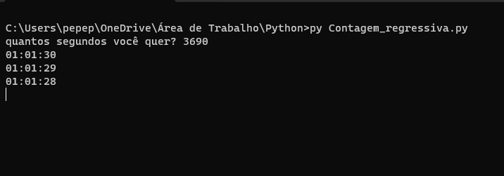

# Contagem regressiva em python 🐍

## Como usar
* Instale o `python` na sua máquina -> [Baixar](https://www.python.org/)
* Faça o clone do repositório na sua máquina
~~~
    git clone https://github.com/pedromarchioretto/python_timer.git
~~~
* Abra o cmd e entre no diretório que foi feito o clone ou abra a pasta do arquivo no `Visual Studio Code`
* Dentro da pasta, execute:
~~~
    py Contagem_regressiva.py
~~~

* Digite quantos `segundos` você deseja colocar no timer e dê enter:

